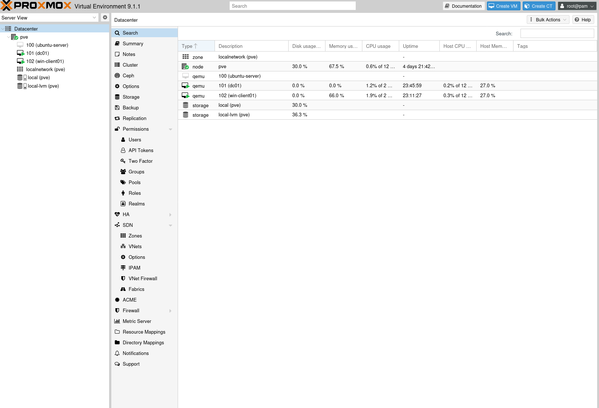
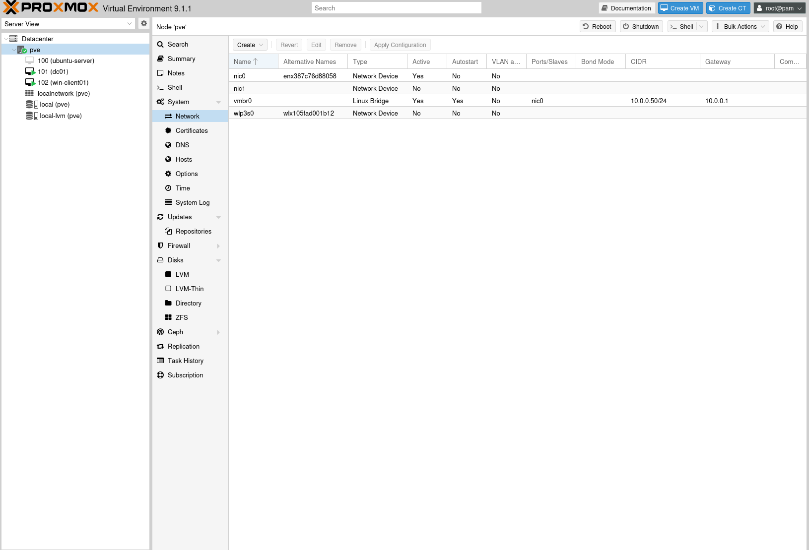
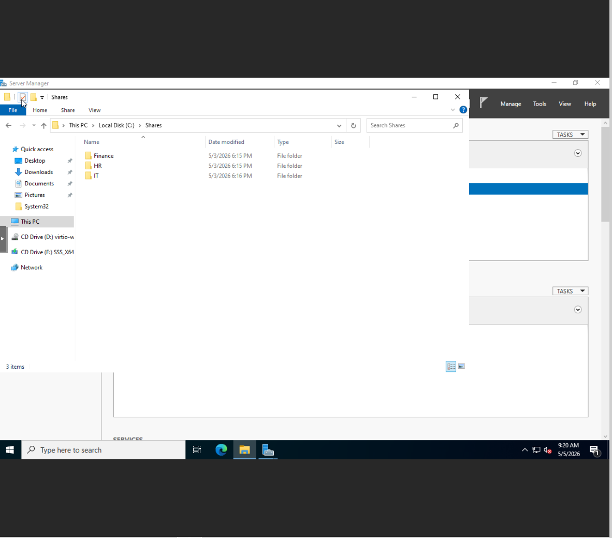
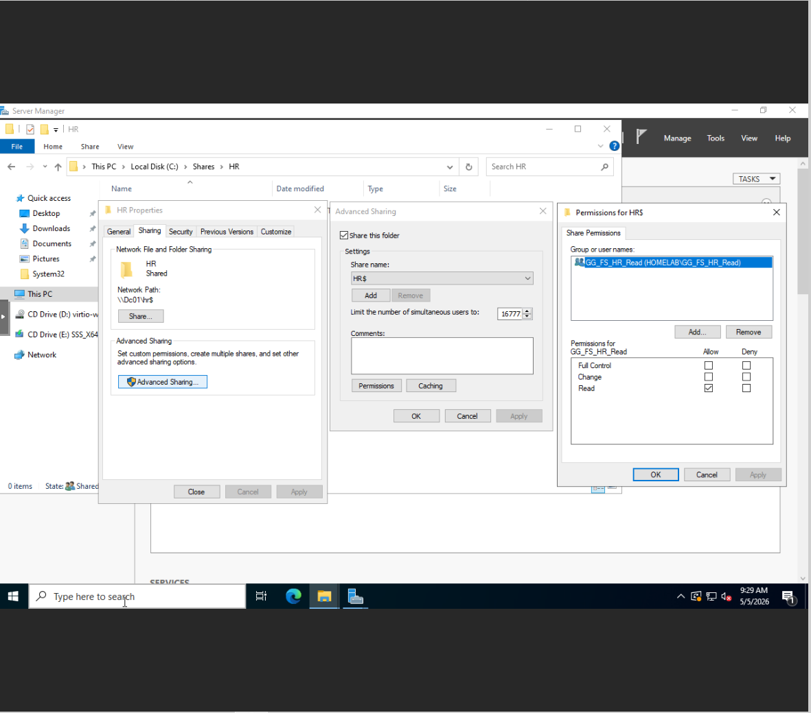
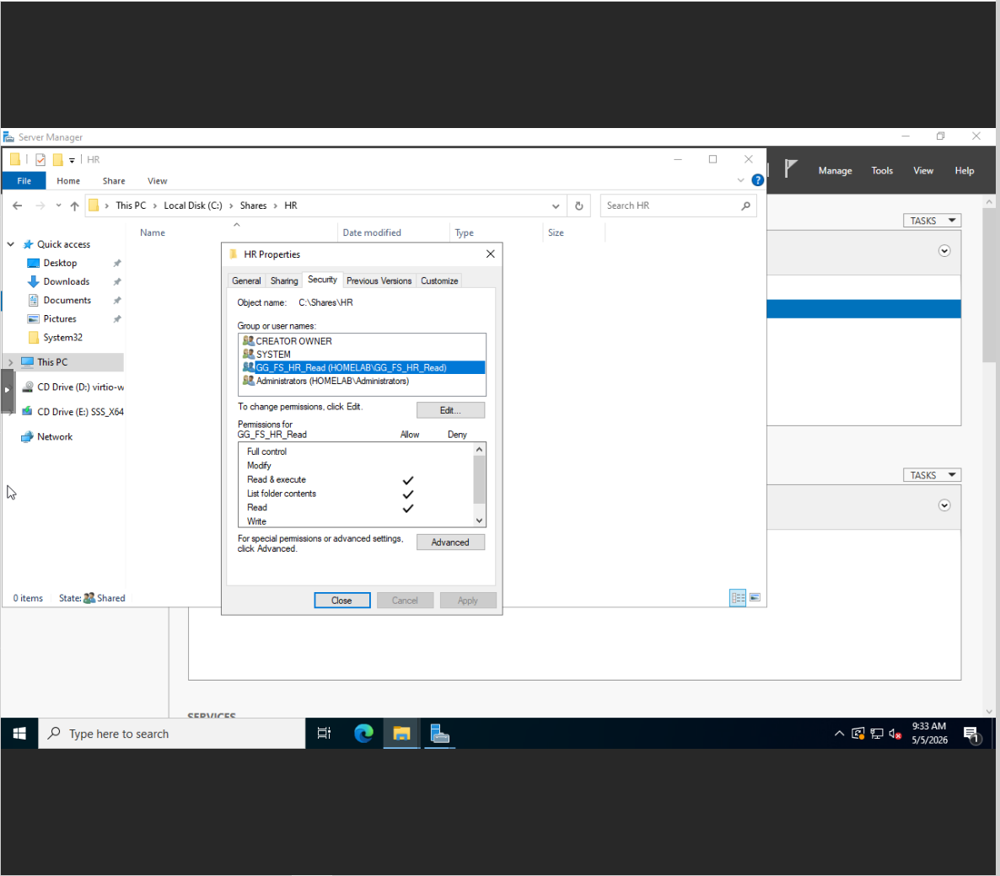
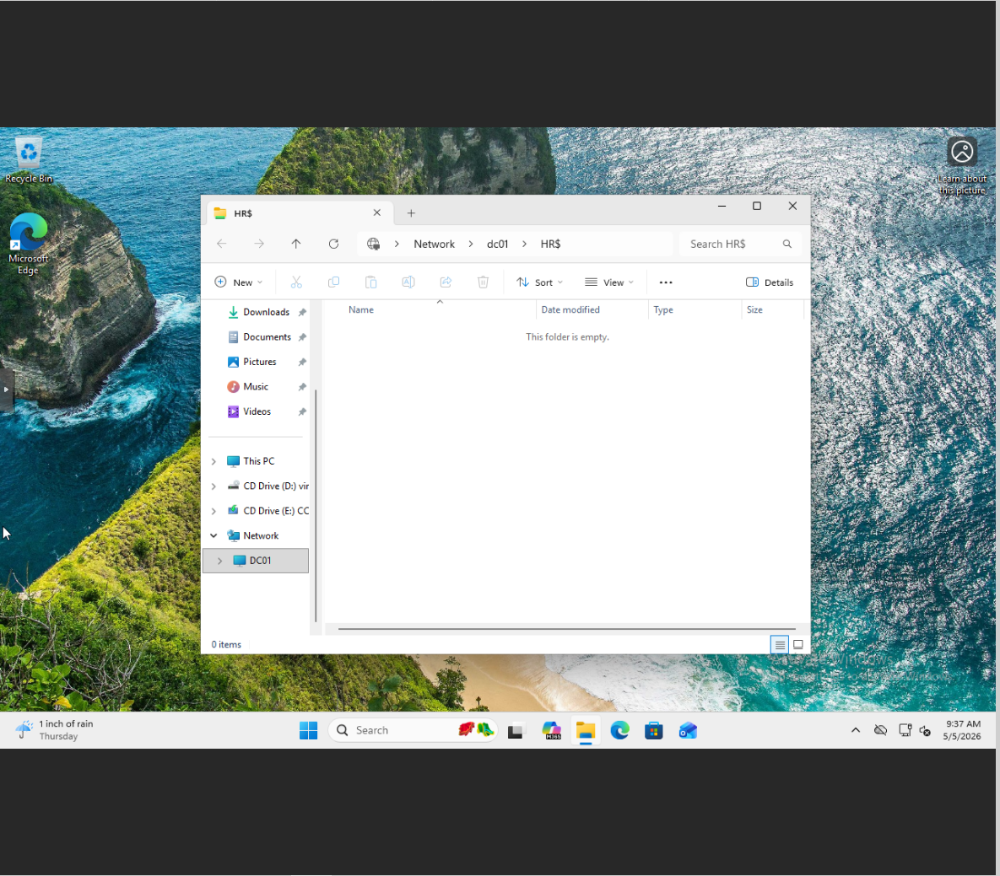
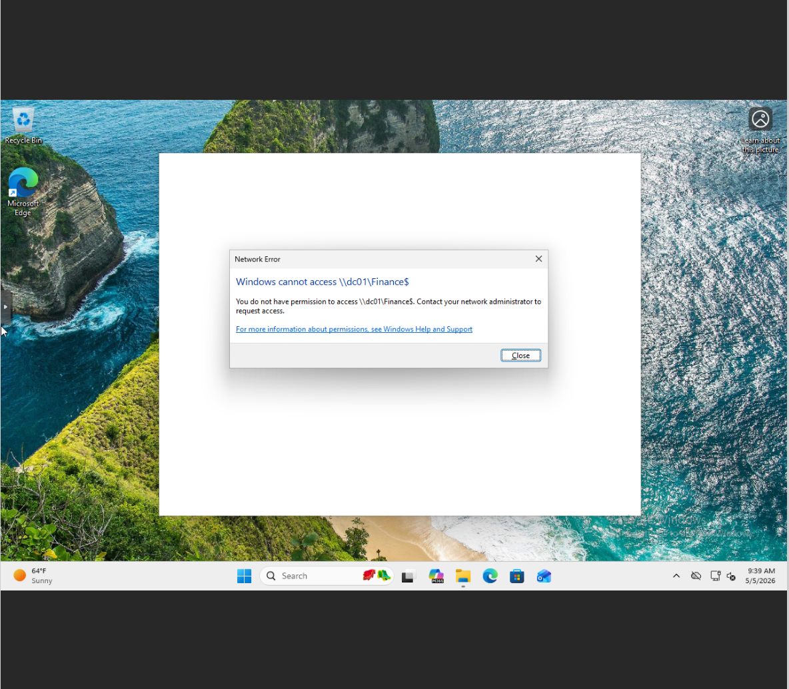

# Enterprise IAM Active Directory Lab

## Overview
Designed and implemented a simulated enterprise Identity and Access Management (IAM) environment using Active Directory.

This lab replicates real-world enterprise scenarios by enforcing:
- Role-Based Access Control (RBAC)
- Principle of Least Privilege
- Centralized identity management
- Policy-based access enforcement using Group Policy

---

## Architecture

### Proxmox Virtual Environment

### Network Configuration

### Environment Design
- **DC01 (Domain Controller)** → Active Directory + DNS
- **WIN-CLIENT01** → Domain-joined workstation
- **Network Range** → 10.0.0.0/24
- **Gateway** → 10.0.0.1

---

## Environment
- Proxmox Virtualization
- Windows Server (Domain Controller)
- Windows 11 Client
- Domain: homelab.local

---

## What I Built

### Active Directory
- Designed Organizational Unit (OU) structure
- Created users and security groups
- Implemented role-based access control

### File Shares
- Created HR, Finance, and IT shares
- Configured Share permissions
- Configured NTFS permissions

### Access Control (RBAC)
- HR users → granted access to HR share
- Non-HR users → denied access
- Access enforced using security group membership

### Group Policy (GPO)
- Automated drive mapping (H:)
- Used Item-Level Targeting (security group-based)
- Verified policy application using gpupdate and gpresult

---

## Proof

### File Share Structure

### Share Permissions

### NTFS Permissions

### HR Access Granted

### Finance Access Denied

---

## Troubleshooting (Real-World Issues Solved)

### DNS Resolution Issues
- Domain join initially failed due to DNS misconfiguration
- Verified using:
  - `ipconfig /all`
  - `nslookup homelab.local`
- Fixed by pointing client DNS to Domain Controller

---

### Domain Join Failures
- Error: “Domain Controller could not be contacted”
- Root cause:
  - DNS not resolving correctly
- Resolution:
  - Verified connectivity (`ping`)
  - Corrected DNS settings

---

### File Share Access Issues
- Share accessible but permissions not working
- Identified mismatch between:
  - Share permissions
  - NTFS permissions
- Resolved by aligning both permission layers

---

### GPO Not Applying
- Drive mapping not appearing on client
- Troubleshooting steps:
  - `gpupdate /force`
  - `gpresult /r`
- Root causes:
  - Incorrect targeting
  - Group membership delay
- Fix:
  - Verified security group membership
  - Confirmed Item-Level Targeting configuration

---

## Outcome
Successfully implemented identity-based access control using Active Directory, security groups, file shares, and Group Policy.

---

## Why This Matters
This project simulates real-world IAM responsibilities performed by:
- IAM Engineers
- Active Directory Administrators
- Security Analysts

It demonstrates the ability to:
- Manage identities at scale
- Enforce least privilege access
- Automate user environments
- Troubleshoot enterprise infrastructure issues

---

## Skills Demonstrated
- Active Directory Administration
- Identity & Access Management (IAM)
- Role-Based Access Control (RBAC)
- Group Policy (GPO)
- Windows Server
- DNS Troubleshooting
- Domain Join Debugging
- File Share Permissions (NTFS + SMB)
- Access Control Design
